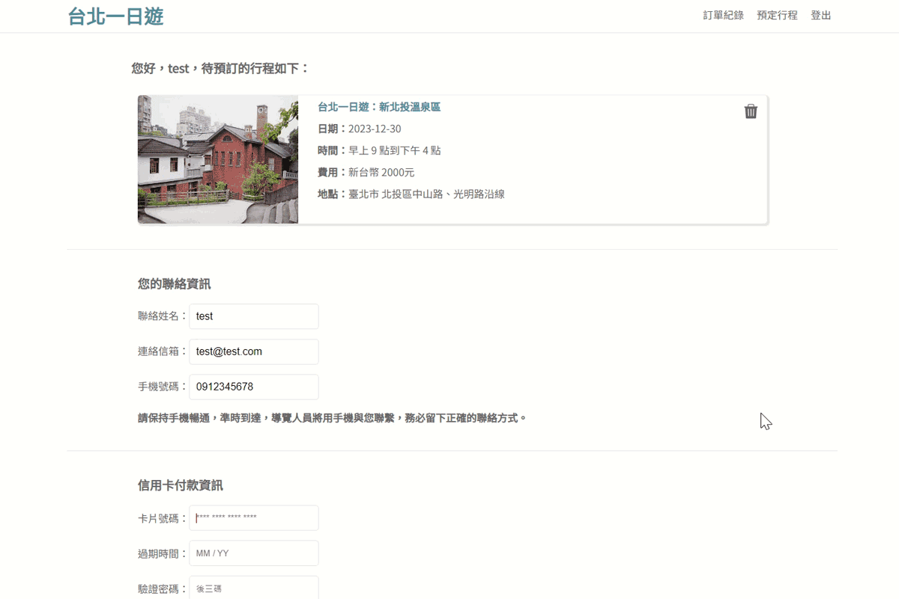

## [Taipei Day Trip](http://44.226.108.69:3000/ "Taipei Day Trip")

A travel e-commerce website that enables users to discover tourist attractions in Taipei and book sightseeing tours.

## Technologies
- Frontend
  - HTML
  - CSS
  - JavaScript
- Backend
  - Python Flask
- Database
  - MySQL
- Cloud service
  - AWS EC2

## Testing Account
- Email : test@test.com
- Password : 12345678
  
## Test Creditcard Info
- Card Number：4242 - 4242 - 4242 - 4242
- Valid Date：01 / 23 
- CVV：123 

## Demo

### Infinite scroll
Implements infinite scrolling using the Intersection Observer API, along with lazy loading to enhance the page load speed.

### Keyword search
Users can search for points of interest by entering keywords.

### Book a trip
After logging in, members can choose a date to book their preferred itinerary. Member verification is performed using JSON Web Tokens.

### Pay by credit-card TapPay
Order payments are processed through the TapPay online payment system, ensuring convenient and secure transactions.

### View history payment
You can visit the member center to view the itineraries you have previously booked.

## Database Schema
MySQL Database Entity-Relationship Diagram

## Contact
Name : 鄭竹晴 Chu Chiang Cheng   
Email : luluching1128@gmail.com